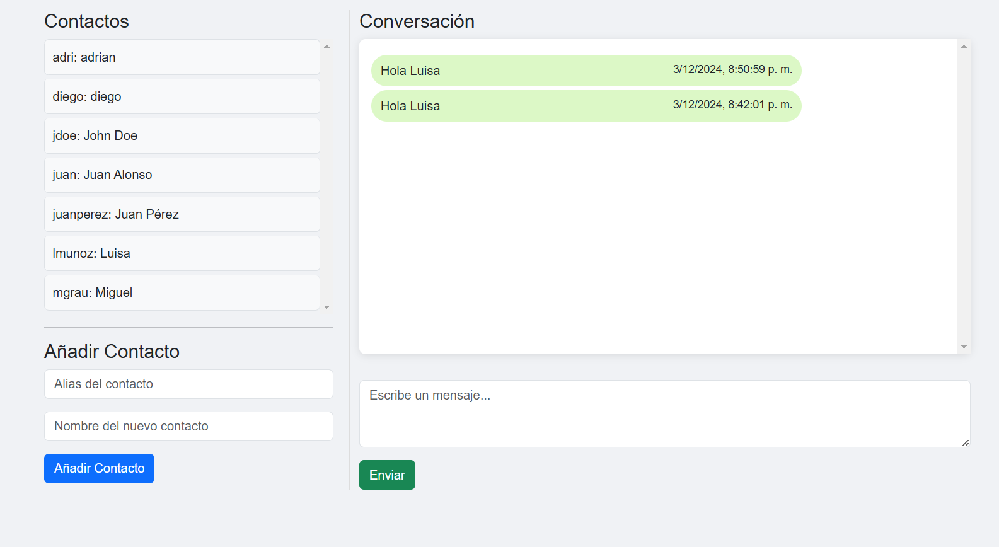

# Integrantes 
- Adrian Auqui Perez
- Hosmer Casma Morales

# Pregunta 3
1. Confirmar el número máximo de contactos
- Se agrega confirmación para evitar que los usuarios excedan el número máximo de contactos.

2. Eliminar contactos y usuarios
-Le permite eliminar contactos y usuarios, pero los mensajes enviados permanecen incluso si se elimina el contacto o usuario

3.  Nuevo caso de prueba

- No se pueden agregar nuevos contactos si se alcanza el número máximo.
- Comprobar que los mensajes no se eliminaron cuando se eliminó el contacto.
-  Asegurar de que los mensajes de los usuarios se conserven después de su eliminación.

4. Riesgo de romper la funcionalidad existente
- Pueden ocurrir problemas cuando los mensajes o contactos se eliminan incorrectamente
- Demasiados contactos pueden afectar el rendimiento
- Es importante que los mensajes no se eliminen accidentalmente al eliminar un contacto o usuario.
- Realizar pruebas rigurosas para garantizar que las nuevas funciones no afecten la funcionalidad existente.

